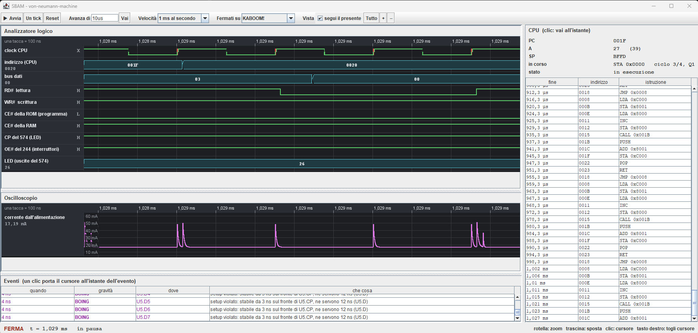

# SBAM Modeler – Simple Bus Architecture Machine Modeler
*"find the bang before it happens on your bench"*

**SBAM Modeler** è un simulatore deterministico a passo fisso progettato per modellare ed analizzare il comportamento elettrico, logico e temporale di bus paralleli e sistemi a microprocessore.




## Architettura a Layer
Il motore è strutturato su 4 layer software verticali affiancati da una toolchain e da strumenti di diagnostica trasversali:

- **Fisico**: Netlist, fili, bus, nodi, tensioni e assestamento di rete
- **Digitale**: Stadi di I/O, famiglie logiche (TTL/CMOS), ritardi, VDD/GND
- **Logico**: Sincronia, clock, stimoli temporizzati, Setup & Hold
- **Hardware**: CPU, RAM, ROM, logica generica, componenti passivi e I/O

**Toolchain & Diagnostica**: Assemblatore, strumenti di misura (VCD), sentinelle di monitoraggio e interfaccia GUI.


## Packages
| Pacchetto | Contenuto e Scopo |
|---|---|
| `net.gommagomma.sbam` | **Core:** Gestione della simulazione (`Simulation`), directory di output e sentinelle base. |
| `physics` | **Layer Fisico:** Modello di rete elettrica (`Wire`, `Bus`, `Node`), motore a tick e assestamento della rete. |
| `digital` | **Layer Digitale:** Livello logico dei segnali (`Level`, `Drive`), stadi d'ingresso e d'uscita, famiglie logiche e ritardi. |
| `logic` | **Layer Logico:** Funzioni logiche, device sincroni con le loro finestre temporali e iniezione di stimoli (`Stimulus`). |
| `hardware` | **Layer Hardware:** Componenti generici (CPU Harvard/Von Neumann, SRAM, ROM, gate, decoder, buffer, transceiver, register, counter, oscillator, ...). |
| `instrument` | **Diagnostica:** Sonde (`Signal`) e registrazioni in memoria o file VCD e sentinelle che scrivono nel log eventi. |
| `program` | **Toolchain:** Set di istruzioni, opcodes, registri, assembler e immagini di memoria (`IntelHex`). |
| `gui` | **Interfaccia Swing:** Controllo della simulazione, analizzatore logico, oscilloscopio e log eventi. |
| `examples` | **Esempi pratici:** Circuiti eseguibili standalone o via GUI (tramite flag `--live`). |


## Caratteristiche
* **Modello Fisico:** Modellazione di ritardi di propagazione, capacità parassite, bus contention e stati X / alta impedenza (Z).
* **Tempi dal datasheet**: ogni componente si configura con i tempi come li riporta il datasheet (propagazione, abilitazione, disabilitazione, setup, hold, tempo d'accesso).
* **Sentinelle**: segnalano scontri sul bus, violazioni di setup e hold, correnti oltre il limite, ingressi indefiniti, reti che non si assestano, guasti di una CPU. Finiscono nel registro degli eventi (events.txt e la tabella della finestra), con l'istante e la gravità.
* **Sonde**: le grandezze osservate (livelli, parole, tensioni, correnti) si registrano su file VCD, da aprire con un visualizzatore come GTKWave.
* **CPU e programmi**: CPU con proprio set di istruzioni, accumulatore, indirizzi e stack in memoria, e tempi di risposta. I programmi si scrivono in assembly e sono assemblati in immagini da mettere in ROM, ed in formato Intel HEX da scrivere su una EPROM vera.
* **GUI Live:** Analizzatore logico e oscilloscopio integrati e controllo step-by-step dell'esecuzione su pannello Java Swing.


## Quick Start
### Requisiti
* Java JDK 11+
* Maven

### Compilazione ed Esecuzione
```bash
# Compilazione del progetto
mvn clean compile

# Esecuzione dell'esempio `VonNeumannMachine` in modalità batch (generazione file di log e VCD):
mvn exec:java -Dexec.mainClass="net.gommagomma.sbam.examples.VonNeumannMachine"

# Esecuzione dell'esempio con l'interfaccia grafica Swing, l'analizzatore logico e il controllo step-by-step:
mvn exec:java -Dexec.mainClass="net.gommagomma.sbam.examples.VonNeumannMachine" -Dexec.args="--live"

# Alternativa senza Maven, dopo la compilazione:
java -cp target/classes net.gommagomma.sbam.examples.VonNeumannMachine --live
```

## Esempi
| Esempio | Che cosa mostra |
|---|---|
| `RcCharge` | la carica di un condensatore attraverso una resistenza, confrontata con la formula |
| `LedResistor` | la corrente in un LED al variare della resistenza (`--live [ohm]`, default 330) |
| `SchmittOscillator` | un oscillatore RC con un invertitore a trigger di Schmitt (74HC14) |
| `Contention` | due uscite che pilotano la stessa linea in disaccordo: lo scontro e le correnti |
| `DipSwitchLeds` | dip switch, resistenze di pull-up, un transceiver (74HC245) e una barra di LED |
| `RamBench` | scrittura e rilettura di una RAM (62256) a mano, con interruttori e pulsante |
| `RegisterBench` | un registro (74HC574) caricato da un pulsante, con una violazione di setup voluta |
| `CounterLeds` | un contatore (74HC161) con oscillatore, azzeramento e LED |
| `HarvardMachine` | una CPU Harvard con RAM, decoder (74HC139), porta d'ingresso (74HC244) e d'uscita (74HC574) |
| `VonNeumannMachine` | una CPU von Neumann con il programma in ROM (27C256, da `von-neumann-machine.asm`), una subroutine e lo stack in RAM |
